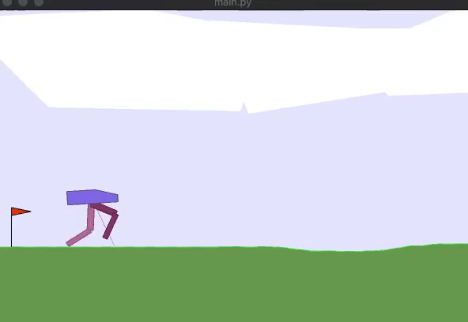
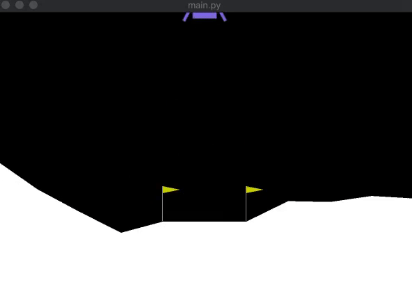

# Twin Delayed DDGP

Pytorch Implementation of Twin Delayed Deep Deterministic Policy Gradients Algorithm for Continuous Control as described by the paper [Addressing Function Approximation Error in Actor-Critic Methods](https://arxiv.org/abs/1802.09477) by Scott Fujimoto, Herke van Hoof, David Meger.

## Results

### BipedalWalker-V3

**Environment Link:** [https://gym.openai.com/envs/BipedalWalker-v2/](https://gym.openai.com/envs/BipedalWalker-v2/)

**Mean Reward:** `295.263390447903` sampled over `20` evaluation episodes.

Experiment Conducted on **Free-P5000** instance provided by [Paperspace Gradient](gradient.paperspace.com).



### LunarLanderContinuous-V2

**Mean Environment Link:** [https://gym.openai.com/envs/LunarLanderContinuous-v2/](https://gym.openai.com/envs/LunarLanderContinuous-v2/)

**Reward:** `272.55341062406666` sampled over `20` evaluation episodes.

Experiment Conducted on **Free-P5000** instance provided by [Paperspace Gradient](gradient.paperspace.com).



## Reference

```
@misc{1802.09477,
    Author = {Scott Fujimoto and Herke van Hoof and David Meger},
    Title = {Addressing Function Approximation Error in Actor-Critic Methods},
    Year = {2018},
    Eprint = {arXiv:1802.09477},
}
```
